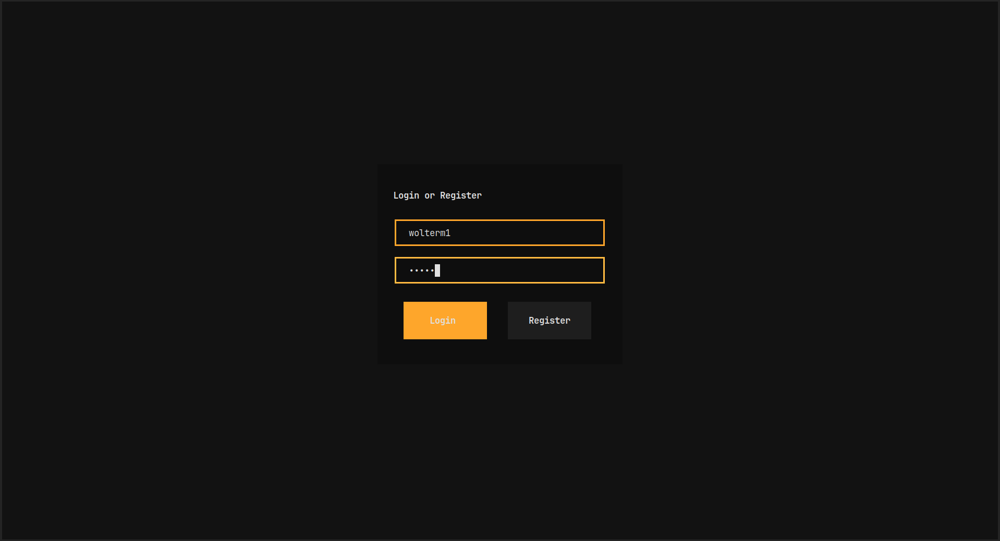
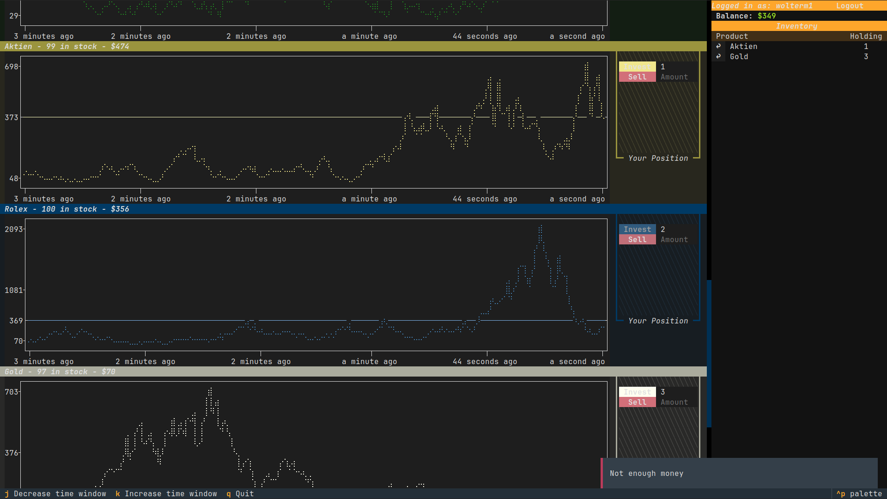

# projectstockmarket
A Simulation of a Stock-Market. You can create an Account and login with credentials and then buy and sell Stocks with UI and monitor your current Holdings in your Dashboard

## Dependencies: 
- A C++ Compiler
- CMake
- Python + pip
- SQLite: https://www.sqlite.org/

## Installation
```bash
git clone https://gitlab.informatik.uni-bonn.de/gamma-jmt-group/projectstockmarket.git

cd projectstockmarket

cmake -S stock_mechanics -B stock_mechanics/build
cmake --build stock_mechanics/build

cmake --install stock_mechanics/build

pip install -e server
pip install -e client

```

## Starting Server and Graphical Client

```bash
python3 -m server/trading_server

python3 -m client/trading_client
```

## Preview

Login Screen


Trading View

